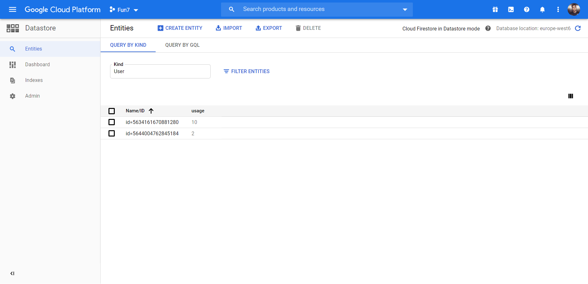

# Fun7 REST API

REST API developed in Java Spring Boot framework, used for checking enabled/disabled features and services provided by the Fun7 mobile game. The API exposes a single endpoint which gives information about the ads, multiplayer and customer-support services.

## Requirements

* Java 11

## Getting Started

### Setup

1. Clone project repository to local machine

   `git clone https://github.com/damir1407/fun7`

2. Change to project working directory

   `cd path\to\project\fun7`

### Datastore entities

Image below shows the available users and their corresponding usage counts in the GCP Datastore.

### Running the app

1. Start the local server by running `fun7-0.0.1-SNAPSHOT.jar` build, found in the `target` directory (port is set to 8080).

    `java.exe -jar path\to\project\fun7\target\fun7-0.0.1-SNAPSHOT.jar`
  
2. Perform an HTTP request using this URL:

   `localhost:8080/api/v1/features?userId=chosenUserID&timezone=America/New_York&cc=US`
   